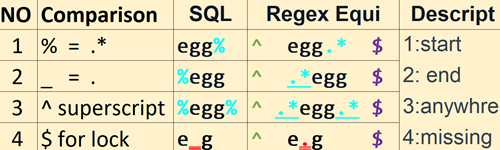
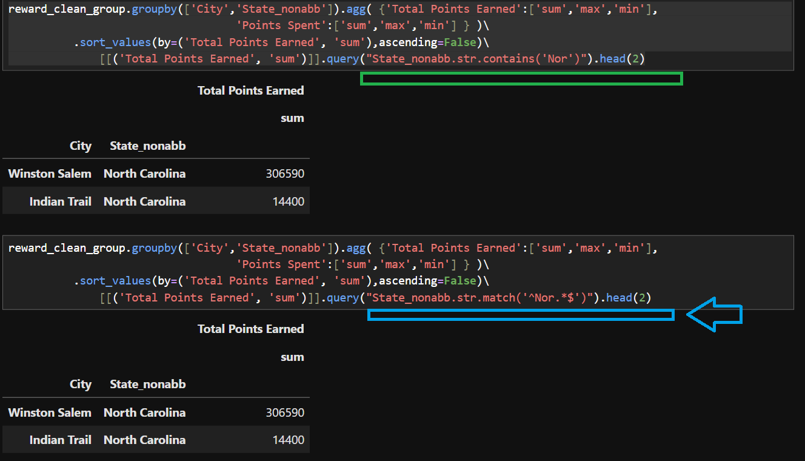
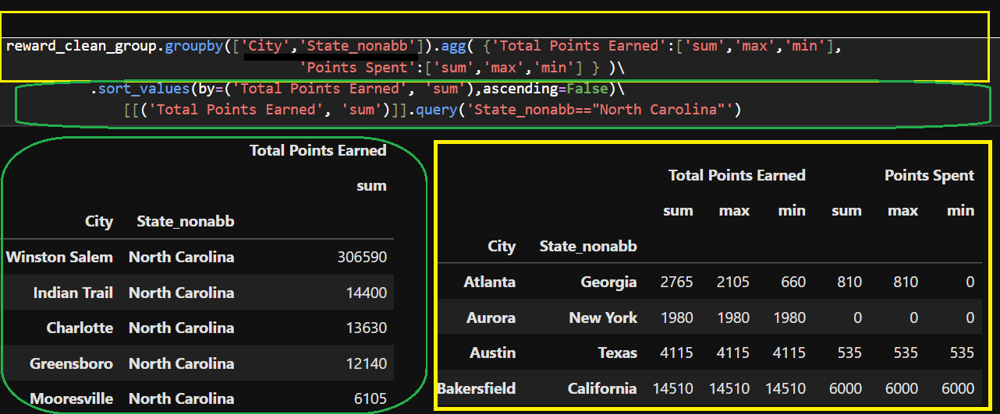

#   
Pandas DataFrame&emsp;

### load dataset
#### seaborn 
##### syntax 
###### iris_df = sns.load_dataset('iris')
###### titanic_df = sns.load_dataset('titanic')
###### tips_df = sns.load_dataset('tips')
##### available datasets
###### iris 
###### titanic
###### tips
###   

read_files.
####  pd.read_csv
##### read_fwf()
##### read_table() 
##### read_json
##### read_clipboard
##### csv  
###### abbrevaition 
* &emsp;c&rarr;comma &emsp;s &rarr; separated &emsp;&emsp;v- &rarr;value
###### sep=','
* 1 ','    &emsp;comma separated file
* 2 '\t'   &emsp;tab separated file
* 3 ';'   &emsp;semicolon separated file
* 4 ' '   &emsp;space separated file
* 5 '|'   &emsp;vertical bar separated file
##### syntax 
######  parameters selection
*    sep – specify delimiter (default is ,)
*    header – row number(s) to use as column names
*    index_col – set column(s) as index
*    usecols – load only specific columns
*    nrows – read only a fixed number of rows
*    skiprows – skip specific rows at start or by index*
######  parameters conversion
*    dtype – set data types for columns
*    parse_dates – parse date columns automatically
####  pd.read_excel
##### xlsx  
###### xl&rarr;excel 
###### &emsp;s &rarr; spreadsheet
###### &emsp;&emsp;x- &rarr;cell
##### syntax 
######  parameters selection
* engine:='xlwings'.
* io: The path or URL of the Excel file.   |same directory only file name and extension are required to be passed in as|
######  parameters selection
* sheet_name: The sheet to read. Default is 0 (first sheet).  Can be a string, integer, list, or None.
* header: Row number(s) to use as the column names. Default is 0.
* names: List of column names to use.
* index_col: Column(s) to set as index.
* usecols: Columns to parse.
* skiprows: Rows to skip at the start.
* nrows: Number of rows to parse.
######  parameters date dtype
* parse_dates: Parse dates.
* date_parser/date_format: Function or format for parsing dates.
* dtype: Data type for data or columns.
* converters: Dict of functions for converting values in certain columns.
* true_values/false_values: Values to consider as True/False.
######  parameters na handle
* na_values: Additional strings to recognize as NA/NaN.
* keep_default_na: Whether to include default NaN values when parsing data.
* na_filter: Detect missing value markers (empty strings and the value of na_values).
* verbose: Indicate number of NA values placed in non-numeric columns
######  parameters formatting  
* thousands/decimal: Thousands separator and decimal point character for parsing string columns to numeric.
* comment: Comments out remainder of line.skipfooter: Rows at the end to skip.
####  pd.read_html
##### html  
###### ht&rarr;hypertext 
###### &emsp;ml &rarr; markup language
##### syntax 
######  parameters selection
*    io: A string, path object, or file-like object representing a URL or the HTML itself.
*    match: A regex or string to match text in the tables.
*    flavor: The parsing engine to use ('lxml', 'html5lib', 'bs4').
*    header: Row(s) to use as the column names.
*    index_col: Column(s) to set as index.
*    skiprows: Rows to skip after parsing the column integer.
*    parse_dates: Parse columns as dates.
###### parameter formatting
*    attrs: Dictionary of attributes to identify the table in the HTML.
*    thousands: Separator for thousands.
*    encoding: Encoding to decode the web page.
*    decimal: Character to recognize as decimal point.
###   

create df series.to_frame() 
##### characteristics
##### 1d labelled array 
* series must contain homogenous values 
* &emsp;same type
* 1 column with row index AKA row label
* constituent parts of a dataframe
* &emsp;dataframe is a container for sereis 
##### Creation
###### list&emsp;&emsp;|s_df
####### pd.Series([,,,..]).to_frame()
###### tuple&emsp;|s_df
####### pd.Series((,,,..)).to_frame()
###### dict.&nbsp;&emsp;|s_df
####### pd.Series({'key1':'val1',&emsp;'key2':'val2'}).to_frame()
* only columns needed as index has already been given by keys
* 
should always avoid creating series using dict as its less intuitive 

###### np.arry|s_df
####### pd.Series(np.array([,,,..])).to_frame()
###    

create df pd.DataFrame() &rlarr; df.to_dict|list|tuple|arrays&ensp; 
##### characteristics
##### 2d labelled arrays|2d container for sereieses 
* n column with row indces :AKA row label and column label
* container for multiple series 
* all sereis share a common index labelthat's the row label
##### reversion df
###### df.to_dict()
* most convenient only index is needed or generate by default 
###### list
* df.values.to_list() nested lists row by row don't have keys 
* df['coln'].to_List()  compile a list of data enties in a single colum
* df.loc[n,:] returns both values and column header names 
###### tuple workaound 
* list(df.itertuples(index=False, name=None))
* df.loc(0,:)
* df['coln'].to_list()
###### array
* np.array(df)
* df.to_array()
* df.values()
###### df.to_list()
##### Creation
###### lists&emsp;&emsp;|df
* pd.DataFrame([,,,..],[,,,..] ,index=['','',..],columns=['','',..])
* single lists 
* index and columns both are needed
###### tuples&ensp;&nbsp; |df
* pd.DataFrame(((),(),..))
###### matrix&ensp;|df
* pd.DataFrame(np.eye)
* pd.DataFrame(np.identity)
* pd.DataFrame(np.array([&nbsp;['','',''],['','',''],['','','']&nbsp;]))
###### dicts&nbsp;&emsp;&ensp;|ex
* comparison with Excel
* 
 "key":['','',..]  rotation excel columns and rows &rarr;key-col index column header &rarr;['','',...] value in each next row is separated by a comma

###### dicts&nbsp;&emsp;&ensp;|df
* import !!!! if key value are 1:1 pairs 
* 
  &emsp;then it needs to be converted into a list and then pass into a pd.DataFrame() method   &emsp;reason : the 1:1 pairs will have extremely wide columns with only one single row - that's populated with values keys as column headers  &emsp;on the contary , to form two columns using keys and values   &emsp;separaetly , can be realized either using a for loop to append keys and values separately into two individual lists  &emsp;method 2 pd.DataFrame(list(dict.items(), columns=['',''])

* pd.DataFrame(dict({"colh":['','',..],&ensp;"colh":['','',..] }), index=['',''..]
* columns headers have already been provided 
* using dictionary key - value is the content in the column
###### np.arrys|df
* pd.DataFrame(np.array([['',''],['','']..]), index =['',''..] , columns =['','',..])
* nested lists
* columns headers and index are both needed
### frame 2 indeces
#### methods involving index 
##### string.index|find('substring')
##### set_index 
###### df.set_index('x')
###### df.set_index(['year', 'month']
##### reindex 
###### df.reindex(['','',''])
##### multiindex
###### 5 princeples for accessing
*
 Always use .loc for accessing MultiIndex data to avoid ambiguity.
* Ensure the index is sorted for efficient slicing and selection.
* Use get_level_values(level) to extract values from a specific level of the index.
* For single column access using df[('')] |multi index column access df[('coln','indexn')] eg df[('convicts','sum')] df[('convicts','mean')]
* for differentiation between regular df and multiindex
for specific index value access using df.xs('value',level='indexname')

###### using 
* Once you have a MultiIndex, you can use it to perform various operations:
*  &emsp;&emsp;&rarr;1: Indexing and Slicing: 
*  &emsp;&emsp; &emsp;&emsp;df = pd.DataFrame({'A': range(8)}, index=multi_index) print(df.loc['bar']) Output: A second one 0 two 1
*  &emsp;&emsp;&rarr;2: Swapping Levels: df_swapped = df.swaplevel(0, 1) print(df_swapped) Output: A second first one bar 0 bar 2 baz 4 baz 6 two bar 1 bar 3 baz 5 baz 7
*  &emsp;&emsp;&rarr;3: Sorting Levels: df_sorted = df.sort_index(level=1) print(df_sorted) Output: A first second bar one 0 one 2 two 1 two 3 baz one 4 one 6 two 5 two 7
*  &emsp;&emsp;&rarr;4: Resetting Index: df_reset = df.reset_index() print(df_reset) Output: first second A 0 bar one 0 1 bar two 1 2 baz one 2 3 baz two 3
###### accessing
* 
* 
###### practical applications
* MultiIndex is particularly useful when working with complex datasets that have <mark>multiple levels of categorization, </mark>
* such as financial or time-series data. 
* &emsp; 1: It allows you to group data by multiple variables simultaneously,
*  &emsp;&emsp;revealing insights that might not be apparent from a single-level grouping.
*  &emsp;&emsp;For example, you can group data by <mark>both time and location</mark>, allowing analysts to examine trends in specific regions over time.
*  &emsp; 2: Additionally, MultiIndex can be used to efficiently select an subset data, providing a convenient way to access specific subsets of the data.
##### boolean indexing
###### why its import 
* |boolean indexing is a very powerful feature that exists in pandas|
* &emsp;&rarr;|it allows us to filter a dataframe or a series based on a boolean conditon | and then we can use it to select specific rows where conditions are true ,
* &emsp;&rarr; its specifically useful for<mark> querying and selecting a subset data based on a specific criteria </mark>and allows to do some complex manipulations 
###### how to create 
* df[ df['Zip'].astype('str').str.len()==5  ] 
* &emsp; important comment - first convert to str datatype
###### example 
* illustration
* 
#### convert index into column to preserve data
##### 1. df.reset_index(inplace=True)
##### 2. df['ncoln']=df.index
###### workflow 
* first assign index to a new column 
* &emsp;it will keep the original index as this phase 
* &emsp;index and new column coexist 
* second create a integer based column using numpy arange 
* &emsp;(range n is determined by the len of a column ) 
* &emsp;df['int']=np.arange(len(df['coln']))
* third use df.set_index('ind') to specify a intbased column as new index 
#### df.set_index('',inplace=True)
#####  syntax how
###### using a targeted column as the new index to replace the default integer  based generic index
###### the intended column will move over to the index position to substitute the original one
#####  use case why ?
###### make dataframe more intuitive 
* string based index -city productid customer id ---
* datetime based index - for resmapling or consolidation 
##### string or a datattime columns
#### df.index
##### it returns a pandas.rangeindex oboject 
##### a tuple of (star=0,end=n,step=n1)
###### slicing index access
* if a single integer is passed in as argument 
* &emsp; then a single index value will be returned
* on the contrary, if a start and end [:] combo is need
* &emsp; then a indexrange object will be returned 
##### df.index.values
###### it returns a numpy array 
#### 1 row label     index row identifiers
##### assignment during creation using index=np.arange() or ['','']
#### 2 column label  columns column headers
##### assignment during creation using columns=np.arange() or ['',''] 
##### acess | update 
###### df.index=['','']
###### columns using integer is rare 
##### acess | update 
###### df.columns=['','']
#### 3 value access 
##### index label(str) |position (n)
##### integer based index - automatically generated by default 
###### df.loc[n1:n2]  -n2 is exlusive
###### df[n1:n2]      -n2 is exlusive
##### string based -customized by assigning a list of str to it
###### df.loc['str1':'str2']  -'str2' incl
###### df['str1':'str2']  -'str2' incl
###   df.to_file&emsp;
#### df.to_csv('filename.csv')
####  df.to_excel('filename.xlsx')
#### df.to_html('filename.html')
##### html table :1 excel to or 2 df 
##### convert df to html 
##### convert excel to html
###### step 1 : 1.1 read_excel 1.2 create datainput
###### step 2 : convert datainput read_in as df
###### step 3 : html_table_1 = df1.to_html(index=False, border=1)\
###### step 4 : with open("table.html", "w", encoding="utf-8") as f: &emsp;&emsp;&emsp;&emsp;&emsp;&emsp;f.write(html_table_1)
#  
agg summary window
##     
 
statistical overview 
### df.corr()
#### syntax & parameters 
###### syntax&emsp;&emsp;&nbsp;
* DataFrame.corr(method='pearson', min_periods=1, numeric_only=False) 
###### eg prior 
* original dataframe
* <table border="1"class="dataframe"><thead><trstyle="text-align:right;"><th>Height&emsp;</th><th>Weight&emsp;</th></tr></thead><tbody><tr><td>150</td><td>50</td></tr><tr><td>160</td><td>65</td></tr><tr><td>170</td><td>68</td></tr><tr><td>180</td><td>80</td></tr></tbody></table>
###### eg after 
* output dataframe
* <table border="1"class="dataframe"><thead><trstyle="text-align:right;"><th>Height</th><th>Weight</th></tr></thead><tbody><tr><td>1.000000</td><td>0.973035</td></tr><tr><td>0.973035</td><td>1.000000</td></tr></tbody></table>
###### parameters
* method: Correlation method (pearson, spearman, kendall), we get pearson correlation by default.
* min_periods: Minimum required matching values
* numeric_only: Includes only numeric columns if True
### df.unique()
#### len(df.unique()) how many number of unqiue values in a column
##### use case 
###### 1 crosstab
* the total number of rows when using crosstab to reconstruct 
* dataframe using multiple columns as argument for index parameter 
* len(df['coln1'].unique())  * len(df['coln2'].unique()) 
###### 2 catagory
* how many catagory does a column contains
* how many unique product codes are there in a column 
* how many emeployees are there in a company 
### df.describe().
### df['coln'].describe
### df.mean()
### df.median()
### df.mode()
### df.count()
### preview
#### df.head() |head
#### df.tail() |tail
#### df.shape
##### The shape attribute returns a tuple
#####  &emsp;representing the dimensions of the DataFrame. 
#####  It provides the number of rows and columns in the format (rows, columns).
#### df.size
##### The size attribute returns the total number of elements in the DataFrame. 
##### It is calculated as the product of the number of rows and columns (rows * columns).
#### list(df.columns)
##### the tabular data structure's width is too large
##### for updating columns 
#### df.sample()
##   

df.info()  | na entry&nbsp;
### df.isna().sum() -each column's number of na
### df['coln'].info()|info
### type vs dtypes vs astyp
#### type(df)
##### type is to check the object's type such as pandas.dataframe pandas.sereis object 
#### df.dtypes
##### dtypes is to confirm the data's type which is the short hand form of datatype
#### df['coln'].astype('int')
##### convert type 
##### by default , the numerical values are floats
### concise summary of a DataFrame
### syantx
#### df.info(verbose=False)&emsp;&emsp;&emsp;&nbsp;
##### Setting verbose=True displays detailed information for all columns, while 
##### verbose=False provides a concise summary, omitting per-column details.
#### df.info(memory_usage=False)
##### True for basic memory details or 
##### 'deep' for a more detailed breakdown, including memory used by objects.
### importance
#### useful for gaining insight into dataframe -
#### understanding the <mark>structure of your dataset</mark> and 
#### identifying potential issues like <mark>missing values&emsp;</mark>.
##### how many entries for each column 
##### how many columns 
##### how many rows
##### how many null value 
##### how much memory it uses 
##### what are the data type for each column 
##  

df.value_count()&emsp;
### useful for counting repeated values such as age
###  how many people are at the age of 20
### catagorical data -count - each catagory 's count
### quick insight 
#### how many business unites are there in a compnay 
#### how many product families are there in each business unite
#### how many combination serieses of each single family 
#### how many combination components of the each sseries 
##  

df['age'].count() &ensp;&ensp;
### simple calculation of the total instances
### value_counts vs count vs sum
##### value_counts() counts catagorical value's number of  occurances
##### count is the total number of occurances regardless of its category  
##### sum can be used to count True | False Boolean values 
###### exmaple - count duplicates 
* dupl=df.duplicated()
* dupl.sum()  If the boolean value is False it will be igonore as it is zero in numeric sense 
### simplest count
##### a column's total number of values 
##### how many entries of records within a column 
## 
  
df.transformVSagg &emsp;&emsp;&emsp;&emsp;&nbsp;VS apply
### comparison table
#### apply flexible 
##### it can apply a function 
###### along an axis 
######  or a grouped dataframe .it can handle both 
* row_wise      axis=1 row-wise is across columns 
* column_wise   axix=0 col-wise is across rows operation 
###### output 
* scalar 
* series 
* dataframe
#### dataframe size&emsp; &rarr;&emsp; &emsp;transform = &emsp; &emsp;&emsp; &emsp; &emsp;agg &emsp;&emsp;&nbsp;&nbsp;<
##### overview
##### <table border="1" class="dataframe"><thead><tr style="text-align: left;"><th>aspects</th><th>df.agg()</th><th>df.transform()</th></tr></thead><tbody><tr><td>Purpose:</td><td>Performs aggregation —  reduces data to a smaller shape.</td><td>Performs broadcasting transformations —  returns an output with the same shape as the input.</td></tr><tr><td>Behavior:</td><td>The function is applied to each column (or row if axis=1) and  returns a scalar, Series, or DataFrame depending on the  aggregation.</td><td>The function is applied to each column individually and must return  a sequence of the same length as the group or DataFrame.</td></tr><tr><td>Use case:</td><td>Summarizing data, e.g., computing mean, sum, min, max, etc.</td><td>Group-wise normalization, filling values, or applying functions where  the result needs to align with the original index.</td></tr><tr><td>Shape:</td><td>Output is smaller than the input (reduced dimensions).</td><td>Output is same size as the input (broadcasted results).</td></tr></tbody></table>
###### comparison example df
###### 
### agg() | mostly df|
#### single column |df single function
##### df.agg('sum')
##### df['coln'].agg('sum')
#### single column|df multiple functions 
##### df.agg(['sum', 'min'])
##### df['coln'].agg(['sum', 'min'])
#### multiple columns multiple functions 
##### df.agg({'A': ['sum', 'min'], 'B': ['min', 'max']})
## 
  
df['col'].transform() 
### syntax 
#### df.trasform(lambda x:x*10)
#### df.transform(def)
#### df.groupby('x')['coln'].transform(function)
### use case
#### find outliers 
##### example:
##### &emsp; workflow of finding 10 outliers- find groupby mean- outliers  groupmean outlier
##### 
&emsp;&emsp;cars['mean']=cars.groupby(['model_year','origin']).mpg.transform('mean').round(2) &emsp;&emsp;&emsp;&emsp;&rarr;create a mean column &emsp;&emsp;cars['mpg_outlier']=(cars.mpg-cars['mean']).round(2) &emsp;&emsp;cars.loc[cars.mpg_outlier.abs()>10]  &emsp;&emsp;&emsp;&emsp;&rarr;create a new dataframe using filter condition absolute value

#### substitute merge 
##### pd.merge(df_order ,df_ordertotal,on='id',how='left')
##### 
#### filter 
##### 
#### apply multiple functions to multiple columns simultaneously 
##### df.transform({'':func, lambda x：x*10})
##### example
##### 
#  
plt for self reference&ensp;&nbsp;
## single plot types overview
### <mark>relplot |  lmplot </mark> marker | linesgement  &emsp;continuous data | treand over time. &ensp;&rarr;a marker is the data point which is composed of x y coordinates &ensp;&rarr;lm represents linear model that deals with regression  &emsp; 
####   

 line scatter &emsp;regression 
##### scatter plot overview 8 sub catagories
###### regular scatter 
* purpose :see distribution of data , spot outlier and detect clusters 
###### animated scatter 
* play axis - use datetime as x
* purpose: to see how the distribution is  changing over time or catagory
###### bubble 
* besides the regular x y variable for scatter points 
* it adds extra size parameter to it for us to better visualize compaison
* or to highlight a particular data point
* for example : it might be used call attention to margin which one has the greatest margin  
###### quadrant plot 
* data is broken into quadrants 
* useful for segmentation 
* to identify which product catagory is performing the best | worst
###### volcano plot
* comparison x indicate change |such time or before after certain change|
* Optimization minus on the left side and plus on the right 
* bottom and top performer 
###### connectd scatter 
* small number of data points
* how evolve over the last few years 
###### joint plot
* scatter ploot + x margin and y margin 
* distribution more clearly seaborn 
######  swarm plot 
* single measure y axis
* catagories to compare x axis
* jitter compare distributin and identify outliers 
### <mark>catplot</mark> catagorical data |purpose  &emsp;performance contribution compare. &ensp;&rarr;a bar or slice of a pie represents a catagory's height|contribution
####   

 bar barh pie &nbsp;area 
###  <mark>displot</mark>  frequency | bins bar or curve  &emsp;distribution central tendency outlier &ensp;&rarr;box the majority - whicker outliers |fill  bins at fixed interval curve
####   

box &nbsp;hist &nbsp;kde
##### kde | his 
*  hist &rarr;&nbsp; bars 1width with represent bins boundaries 
*  &emsp; &emsp; &emsp; &emsp; &ensp;2height repsents frequency 
*  kde &rarr;kernel density estimation 
*  &emsp; smooth out the edges of the bins|bars to form a curve 
*  &emsp; &rarr;smoothed continuous version of histogram
##### box | whisker
* box the 50% four quartiles 
* spot outliers 
## ax vs figure
### figure canvas 
### ax each individual plot 
### axes , fig=plt.subplots(n1,n2,figsize(n3,n4))
## mul plot types |correlation
### pairplot
#### sns.pairplot(data)
##### parameter 
###### data specifier
*    vars=None,
*    x_vars=None,
*    y_vars=None,
*    dropna=False,
###### sub-group
*    hue=None,
*    hue_order=None,
###### diagonal plot type  
*    diag_kws=None,    |diag_kws={'multiple':'stack'})
*    &emsp;kws &rarr;key words &rarr; a dictionary is expected
*    diag_kind='auto', |kde
###### plot type
*    kind='scatter',
###### styling  
*    palette=None,
*    markers=None,
*    height=2.5,
*    aspect=1,
*    corner=False,
*    plot_kws=None,
*    grid_kws=None,
*    size=None,
##### parameters blocks
###### block
###### 
sns.pairplot(data,*,hue=None,hue_order=None,palette=None, &emsp;vars=None,x_vars=None,y_vars=None,kind='scatter', &emsp;diag_kind='auto',markers=None,height=2.5,aspect=1, &emsp;corner=False,dropna=False,plot_kws=None,diag_kws=None, &emsp;grid_kws=None,size=None,)

##### illustration
#####  

### jointplot = &emsp;scatter + dist
#### 
##### illustration
#####  

### heatmap
#### sns.heatmap(df.corr())
##### illustration
#####  

###### principle 
###### display data in matrix which is color coded to 
* show the relationship bwteen fetures 
* recognize cluster with data 
###### <mark>best practice </amrk>
* &emsp;if not crowded - annotation
* &emsp;if its too crowded add vertical Color bar or legend for reference of the value range 
## mutiple plot grid plot  subplot 
### syntax 
#### &emsp;axes, fig =plt.subplot(row_number |2|,col_number |2|,figsize=(width, height))
#### parameters |spacing
#####  automatic| fig.tight_layout()
* automatically adjust subplot paramters to give specified padding
* &emsp;pad  |subplot with the overall figure edge
* &emsp;h_pad w_pad =floats |subplot with adjacent one|
##### mannual | plt.subplots_adjust()
###### adjust spacing between suplots 
###### parameters
* left: The position of the left edge of the subplots, as a fraction of the figure width.
* right: The position of the right edge of the subplots, as a fraction of the figure width
* bottom: The position of the bottom edge of the subplots, as a fraction of the figure height.
* top: The position of the top edge of the subplots, as a fraction of the figure height.
* wspace: The width of the padding between subplots, as a fraction of the average Axes width.
* 
hspace: The height of the padding between subplots, as a fraction of the average Axes height.
#### parameter size
##### overall figsize(contains all subplots)
* Note:
* &emsp;figsize affects the whole figure; subplot sizes scale accordingly.
* ajustment after plotting
* &emsp;fig.set_size_inches(12, 6)
* setting during plotting
* &emsp;plt.subplots(n0,n1,figsize(n2,n3))
* &emsp;&emsp;figsize=(width,height) is in inch and applies to the entire figure
##### indiviual size for each subplot 
* principle: through ratio adjusting, one may get larger or smller ratio
* gridspec_kw={:} 
* &emsp; &emsp;{'width_ratios'：[n1,n2]}
* &emsp;&emsp;{'height_ratios'：[n1,n2]} 
*&emsp; fig, ax = plt.subplots(1, 2, figsize=(8, 4), gridspec_kw={'width_ratios': [3, 1]})
### 
&emsp;ax[0,0].plot&emsp;  &emsp;ax[0,1].plot&emsp;  &emsp;ax[1,0].plot&emsp; &emsp;ax[1,1].plot&emsp;

### purpose
#### 1 comparing different datasets
#### 2 comparing different visuals of the same dataset
## plot summary -all libraries   to be updated
###   

pandas | simpliest df['col'].plot(kind='')
#### syntax - df['coln'].plot(kind='')
#### df['coln'].plot()
##### syntax parameters
###### example : df.plot(kind='scatter', x='Height', y='Weight', title='Height vs Weight',  &emsp;&emsp;&emsp;&emsp;&emsp;&emsp;&emsp;&emsp;xlabel='Height (cm)', ylabel='Weight (kg)', figsize=(8, 5))
###### kind=""
* line 
* bar  | barh
* hist | kde
* scatter
* box
* pie
* area
###### data parameters
* x	-data array|column_name x='colname' 
* y -data array|column_name y='colname'
###### annotation parameters
* title	='sales over time'
* xlabel='x'
* ylabel='y'
* plt.legend 
* &emsp;plt.legend(['A Label', 'B Label', 'C Label', 'D Label'], loc='center left', bbox_to_anchor=(1, 0.5))
###### formatting parameters
* color='blue'
* figsiz=(&emsp;8&emsp;,&emsp;2&emsp;)
* autopct='%1.1f%%'
##### plt.legend 
###### plt.legend(['A Label', 'B Label', 'C Label', 'D Label'], loc='center left', bbox_to_anchor=(1, 0.5))
##### other styling related used matplotlib 
####   df.hist()
##### quick check of distributon 
##### bins 
##### parameters 
####  combination &ensp;
##### pandas plot for quick analysis for self reference only 
##### plt and seaborn -seaborn main focus plt adding details and formatting 
##### quickest and simpliest for self reference
### 

matplotlib
#### can be used in combinations with other libarary to add more details 
#### syntax 
##### line
###### df['coln'].plot() 
* no x and y paramters are required , only need to pass in x and y data in proper order
### 

seaborn
#### characteristics 
##### built directly on top of matplotlib
##### appealing for statistical plotting 
##### multi level split data into groups
###### hue 
###### coln rown  
* forms a grid of n columns and n rows 
##### professional rendering effect 
#### syntax 
##### df['coln'].plot(kind='')
### 

sympy math 
#### equation
#### syntax 
##### symbols must be set up for variables 
##### sympy.plot()
### 

manim
#### equation  for animation 
#### 
##### df['coln'].plot(kind='')
### 

dash plotly 
#### syntax -to be updated 
#### plotly express & streamlit
##### most powerful combination px= for quick plotting 
##### plotly only when customization is needed can be considered
#### workflow
##### 1 fig=px.charttype() &rarr;initial plot 
###### 3 essential parameters
* 1 data_frame=df
* 2 x=df['']  &rarr;pie names  &rarr;histogram bins
* 3 y=df[''] &rarr;pie values 
##### 2 fig=px.charttype(extra parameter ) &rarr;adding details
###### visuals 
* barmode &rarr;1 overlay , 2 relative , 3 group
* opacity=0.n &rarr;0-1
* orientation='v'|'h' &rarr;bar vertical or horizontal
###### color |facet&emsp;&rarr; =seaborn hue
* 1 color='cat|num' 
* &emsp;&rarr;1.1&emsp;color_continuous_scale=cyclical|sequential|diverging
* color_continuous_midpoint=n
* range_color=[start, end]
* &emsp;&rarr;1.2&emsp;color_discrete_sequence|map=[]|{}  map is better for precise control over color
* 2 facet
* 2.1 facet_row = int_n - to expand into multiple rows
* 2.2 facet_col = int_n - to expand into multiple columns 
* 2.2 facet_col_wrap = int_n - must be used in combination with  &emsp;&rarr;facet_col to form grid in case of too many columns to be  &emsp;&rarr;accomodated into a single row
###### text | hover 
* text='', 
* &emsp;&rarr;values appear in figure as text labels
* hover_name='', 
* &emsp;&rarr; values appear in bold in the hover tooltip
* hover_data=[''],    
* &emsp;&rarr; values appear as extra data in the hover tooltip
* custom_data=[''],     
* &emsp;&rarr; invisible values that are extra data to be used in Dash callbacks or widgets
###### log axis
* log_x=True,                 
* &emsp;&rarr; x-axis is log-scaled
* log_y=True,                 
* &emsp;&rarr; y-axis is log-scaled
###### statistic error margin
* 0. values must be added to the df prior to the passing of argument to those two parameters
* 1. error_y="err_plus",         
* &emsp;&rarr; y-axis error bars are symmetrical or for positive direction
* 2. error_y_minus="err_minus", 
* &emsp;&rarr; y-axis error bars in the negative direction
###### figure 
* labels={"":" ",
    "":""}, 
* &emsp;&rarr; map the labels of the figure
*  title='Indian Prison Statistics', 
*  &emsp;&rarr; figure title
* width=1400,                   
* &emsp;&rarr; figure width in pixels
* height=720,                   
* &emsp;&rarr; figure height in pixels
* template='gridon',           
* &emsp;&rarr;'ggplot2', 'seaborn', 'simple_white', 'plotly',
* &emsp;&rarr; 'xgridoff', 'ygridoff', 'gridon', 'none'
* &emsp;&rarr;'plotly_white', 'plotly_dark', 'presentation',
###### animation
*  animation_frame='year',    
*  &emsp;&rarr;   assign marks to animation frames
*  &emsp;&rarr; should avoid using  the same name as the x axis
*  animation_group=,         
*  &emsp;&rarr; use only when df has multiple rows with same object
*  range_x=[5,50],          
*  &emsp;&rarr; set range of x-axis
*  range_y=[0,9000],           
*  &emsp;&rarr; set range of x-axis
*  category_orders={'year':np.arange(start,end,step)    
*  &emsp;&rarr;force a specific ordering of values per column
##### 3 fig.update_traces() &rarr;customization
* barchart.update_traces(
*  &emsp;&rarr;texttemplate='%{text:.2s}',
*  &emsp;&rarr; textposition='inside',
*  &emsp;&rarr;width=[,,,,] |different from figure width-   this one is used to configure width of bar_pillars|
##### 4 fig.update_layout() &customization
* barchart.layout.updatemenus[0].buttons[0].args[1]['frame']['duration'] = 1000
* barchart.layout.updatemenus[0].buttons[0].args[1]['transition']['duration'] = 500
* barchart.update_layout(  &emsp;&rarr;  &emsp;&rarr;uniformtext_minsize=14,   &emsp;&rarr;uniformtext_mode='hide',  &emsp;&rarr;legend={'x':0,'y':1.0})
* title="Updated Chart Title",
*  xaxis_title="X Value",yaxis_title="Y Value",
*  plot_bgcolor="white",
*  width=700,height=400,
* template 
*  &emsp;&rarr; annotation "draft|confidential"  -watermark
#### types of charts |A-D|
##### area
##### bar 
###### bar_polar
##### candlestick
##### carpt
###### scatter carpet
###### contour carpet
##### choropleth
###### regular choropleth
###### choropleth map
###### choropleth mapbox
##### cone
##### contour
##### density 
###### density heatmap
###### density contour
#### types of charts |E-H|
##### funnel 
###### regular funnel
###### funnel area
##### gantt
##### heatmap
###### regular heatmap
###### heatmap GL
##### histogram
###### regular histogram
###### histogram 2d
###### histogram 2d contour
#### types of charts |I-P|
##### icicle
##### image
##### indicator
##### line
##### mesh
##### OHLC
##### parallel
###### parallel coordinates
###### parallel catgories
##### pie
#### types of charts |S-S|
##### scatter
###### regular scatter
* plain scatter
* bubble
* animated
* quadrant scatter
* volcano sactter
* connected scatter
* join plot &rarr;|histogram on margin right top scatter in middle|
* swarm plot 
* scatter geo
* box violin - plot scatter along side
###### scatter geo
###### scatter map
###### scatter mapbox
###### scatter 3D
###### scatter GL
##### snakey
##### SPLOM
##### surface
###### regular surface
###### isosurface
##### sunburst
#### types of charts |T-W|
##### table
##### timeline 
###### track progress
##### treemap
##### volume
##### voilin
##### waterfall
# na duplicates
## na percentage ( ( df.isna().sum() ) /len(df)   *100).sort_values( ascending=False ) 
## na count df.isna().sum() -each column's number of na
## nan missing values + duplicates.
## 👁️‍🗨️df['coln'].notna()&ensp;&nbsp;
#### identify 
### 👁️‍🗨️df['coln'].isna()&emsp;&nbsp;
#### identify 
##### alternative methods for identifying nan
###### pandas
* 1 sort_values(na_position)
* 2 df.info
* 3 df.isna()   &emsp; df.isna().sort_values(by="coln",ascending=True)
###### numpy
* only works for numpy array
* np.isnan(np.array([1,23,np.nan]))
###### 
### ✍df['coln'].fillna()&emsp;
#### handle -replace it with a more sensible value 
#### replace
##### =df['coln'].replace(np.nan,None)
* timeseries 
* df.ffill() df.bfill()
* fillna(mean)
* df['Cat'] = df['Cat'].fillna(df['Cate'].mode()[0])
* fillna(dict)
* df.fillna(value={'A': 0, 'B': 1,'C': 'Missing'}) 
### ⛔df['coln'].dropna()
* handle -drop
### 💈df.interpolate()n
#### interpolate na 
#####  fill missing values (NaN) in a DataFrame or Series using various interpolation techniques. 
* eg
* 
time_index = pd.date_range('2023-01-01', periods=5, freq='D')data = [10, &emsp;np.nan&emsp;, 30,&emsp;np.nan&emsp;, 50]
* df = pd.DataFrame(data, index=time_index, columns=['Value'])
* df_interpolated = df.interpolate(method='time')
* print(df_interpolated)
* output:  2023-01-01 <mark>|10.0|</mark> ,2023-01-02 &emsp;20&emsp; ,
* 2023-01-03 <mark>|30.0|</mark>, 2023-01-04 &emsp;40&emsp;,2023-01-05 <mark>|50.0|</mark>

## drop_duplicates 101 
### catagorical data can't be considered duplicates =as they are used for grouping and aggegation
## df['coln'].drop_duplicates(keep)⤫
## df.duplicated(['coln1','coln2',..])👁
### entire row across all columns compared with the nex row 
### subset-1 column -or columns -to compare row column intersections cell by cell or secerial cells across specified columns 
## df.replace(old_value, new_value)
### replace for data cleaning -messy data 
###  
#  
sort filter select &nbsp;

## summary
### sort 
### filter 
### select 
## hidden gem eval
### 1 for verification purpose of input
#### x=eval(input('')) x*3
##### principle 
###### eval will first remove the quotation marks
* 'int' int &rarr;'3' 3
* 'float' float &rarr;'3.2' 3.2
* ''str'' 'str' &rarr; "'x'" 'x'
### 2 create new col via operation -simultaneously
#### df.eval('coln_new=(coln1+coln3)*coln2')
## order rank &ensp; sort
#### df['coln'].rank()
#### syntax parameters
######  axis: 
* 0 or ‘index’ for rows and 
* 1 or ‘columns’ for Column.
######  method: Takes a string input which tells pandas what to do with same values. 
* ‘average’, |default|
*  ‘min’,   
*  ‘max’, 
*  ‘first’,
*  ‘dense’) 
## select 
### rows 
#### integer based indexing
##### single 
###### df.loc[n] &rarr;series | df.loc[[n]] &rarr;dataframe
###### multiple
##### df.loc[n1:n2]
#### label based indexing
##### single 
###### df.loc[''] &rarr;series | df.loc[['']] &rarr;dataframe
###### multiple
##### df.loc['':'']
### columns 
#### integer based indexing |extremely rare can be ignored|
##### single 
###### df.[n] &rarr;series | df.[[n]] &rarr;dataframe
###### multiple
##### df[[n1:n2]]
#### label based indexing
##### single 
###### df[''] &rarr;series | df[['']] &rarr;dataframe
###### multiple
##### df[['':'']] |double brackets
### row and colum combination|&rarr;multiple rows and multiple columns&rlarr;|
#### df.loc[rows,columns]
#### df.loc[['row_index1','row_index2'],['coln1','coln2','coln3']]
### row and colum intersection|&rarr;single cell single column single row&rlarr;|
#### df.loc[n,'columnnames']
## stringtext  col_headers cellvalues   index column label
### iteration 
#### rows 
1. index 
* for index in df.index : &eprint(df['coln'][index])  # index slicing accessor
2. loc[]  
* for index in range(len(df)):print(df.loc[index,'coln'])  #  loc column name 
3. iloc[] 
* for index in range(len(df)):print(df.iloc[index,2]) # iloc index of column
4. iterrows() 
* for index,row in df.iterrows():print(row['coln'],row['coln2'])
5. itertuples()  
* for row in df.itertuples(): print(getattr(row,'coln') #getattr
6. apply()
* print(df.apply(lambda row:row['Colmn'],axis=1)  #row is treated as a small df
#### columns
1. columns 
* for column in df.columns: print(df['column']
2. iterateitems() 
* for coln_name,coln_data in iterateitems(): print(coln_name,sep='\n',coln_data,end='\n')
### filter 101 
#### df.filter(regex='regex')
##### df.ix[row_index, column_name]
#### df.sample(n)
#### shell + condition 
##### shell[cond] -return dataframe that meets condtion  
###### single direct
* df[df['coln']=='x']
###### single negate
* df[~df['coln']=='x']
###### multiple condtions
* df[(cond1) and (cond2)]
* df[df['coln'].isin(['x','y','z'])]
* df[(~df['coln0']=='x') and (df['coln1']=='y')]
* df.query('Age not in ['x','y','z']')
* df.drop(df[df['Age'].isin(ages_to_drop)].index,inplace=True)
##### df.loc[df['coln']=='x','target_coln'] --update values
###### df.loc[df['Gender']='Manager','Years of experience']='Required'
### filter and  info&ensp;&nbsp;
#### -----num_check
##### df['coln'].str.count('x')
###### Count the occurrences of a specific substring in each string of a Series
###### eg
sentences = pd.Series([&emsp;'Python is fun',  &emsp;&emsp;&emsp;&emsp;&emsp;&emsp;&emsp;&emsp;&emsp;&emsp;&ensp;&emsp;'I love Python',  &emsp;&emsp;&emsp;&emsp;&emsp;&emsp;&emsp;&emsp;&emsp;&emsp;&ensp;&emsp;'Python programming is powerful'&emsp;]) python_counts = sentences.str.count('Python') print(python_counts) output:1 2 2 

##### df['coln'].str.len() vs len()
###### len(df.col|ind|c)
* len(&ensp;df['coln']&emsp;) |count how many rows 
* len(df.columns&nbsp;) |count how many columns 
* len( &ensp;df.index &ensp;) | count how many rows 
###### df['coln'].srt.len()
* <table border="1" class="dataframe"><thead><tr style="text-align: right;"></tr></thead><tbody><tr><td> 1&emsp;subquery &emsp;&emsp;&ensp;&rarr;8.0</td></tr><tr><td>2&emsp;NaN &emsp;&emsp;&emsp;&emsp;&rarr;NaN</td></tr></tbody></table>
* return the length of each row's value
* import .srt.len() only applies to df series instead of the whole dataframe
#### ------value access
##### df['coln'].str[n1] |indexing|
##### df['coln'].str[n1:n2] |slicer|
#### ------check values
##### df['coln'].str.startswith('x')
##### df['coln'].str.endswith('x')
##### df['coln'].str.conatins('x')
##### df['coln'].str.match('x') &emsp;
###### columns header names must be unique , otherwise pandas won't be able to return the target the column 
## index column label row label   format case.
### index column label row labels column headers|index| names order-change
#### column headers  reorder rearranged
##### column header names assignment
###### df.columns=['x']
* comment by default pandas's dataframe's columns attribute 
* expect a list of entries  therefore, 
* <mark>even if only one column header exists</mark>,
*  the substitution must also be wrapped in a pair of square brackets 
###### df.columns=['','','',..]
###### df.columns=df.iloc[0]
###### df.rename(columns={'key1':'val1',..},inplace=True)
###### df1=df.set_axis(['a', 'c'], axis='columns') 
###### df.add_prefix('x')
###### df.add_suffix('y')
##### ------column header names' order rearranged
###### df.columns=[&ensp;['y','z','x']&ensp;]
###### &emsp;&rarr; nested list directly<ul><li>&emsp;&rarr; single list: column headers' names assignment &emsp;&rarr; nested list: reordering 
###### df.reindex(columns=['x', 'y', 'z']) |reindex using col_hns
###### df.iloc(:,[3,2,1,0]) |rearranged column headers' index
###### df.pop('coln')&emsp;&rarr;insert(n,coln) 1 col_h_n to the first place 
* workflow -assigan the popped off column to a variable 
* &emsp; pass in the variable as value argument - 
* &emsp;specify location integer and rename -simultaneously
* col_poped=df.pop('col_n')
* df.insert(loc=0, column='x', value=col_poped)
* SYNTAX-Paramter explained
* &emsp;&rarr;loc =position integer
* &emsp;&rarr;column='str' assign column header names 
* &emsp;&rarr;value=what's being popped
#### index row labels  reorder rearranged
##### df.reindex( [' B ',' C ',' A '] )&nbsp;&rarr;&emsp;single level index 
*  pd.Series([1, 2, 3], index=['A', 'B', 'C'])
##### df.reorder_levels['a','b']&rarr;&emsp;multip level index 
* pd.MultiIndex.from_arrays(arr, names=('class', 'diet'))
### datatype change string_formatting
#### pd.to_numeric(df)
#### df['coln'].astype('int')
#### pd.to_datetime(df['coln'])
#### df['coln'].to_string()
#### map vs apply universal format  
#### number format omnipotent syntax 
##### map universal string format of numbers
###### df.map(lambda x: "${: ,.2f}k".format(x/1000))
* comma , is for thousands seprator
* .2f is to keep two decimal places 
* k is suffix
* $ is prefix 
* .format is for function - such as *100 for percentage 
* &emsp; /1000 k /m m
##### apply universal string format  of numbers
###### df['x'].apply(lambda x : '${:.2f}k'.format(x/1000) )
#### map string formatting
##### syntax explnanation 
###### df['coln'].map(mapper)
###### mappper -breakdown 
* '{}'.format is equivalent to f'{}'
* &emsp;&rarr;why we use the former syntax 
* &emsp;&rarr;if we try to incorporate a lambda inside the  &emsp;&emsp;string formatting method , its more flexible 
* use case example 
* convert decimal floats into percentage 
* &emsp;breakdown 
* &emsp;'{}'.format()  within format method the x input can be further processed
###### example code bolck 
* code block
* 
df[&nbsp;'coln'&nbsp;].map(&emsp;lambda x:&emsp; '{&emsp;<mark>&ensp;:&ensp;</mark>.2f&emsp;}%'.<u><b>format(x * 100)</b></u>) &emsp;&emsp;&emsp;&emsp;&emsp;1 &emsp;&emsp;&emsp;&emsp;&emsp;&emsp;&emsp;&emsp;&emsp;&emsp;3&emsp;&emsp;&nbsp;4&emsp;&emsp;&emsp;&emsp;2&emsp;&emsp;&emsp;  &emsp;&rarr;first :  map method passes x input into lambda function  &emsp;&rarr;second format method carries out arithmetic operation by  &emsp;&emsp;multipling x by a factor of 100 &emsp;&rarr;third |.2f =2 floating points| keep two decimal places &emsp;&rarr;fourth concatenation of x*100.2f and  % sign 

### map vs apply  replace vs map 
####  how 
##### apply is to target a specific column to apply function 
##### map is to carry out elemnt wise operation , entire dataframe is affected 
##### replace with dictionary if the entry is mixed
#### why
##### apply function - because each column must contain homogeneous data type , therefore , such as arithmetical function can only be applied to a numeric column 
##### map operation , rows and columns are similar to map's coordinates system which features longitude and latitude
##### map can only use to map consistant input as key to swap with values in dictionary 
* apply vs map summary 
* apply(identical function to col )
* &emsp;df['num'].apply(np.sqrt)
* &emsp;works on entire Series objects rather than individual elements.  &emsp;column wise function -insead of elementwise on the whole dataframe(map)
* <mark>workflow of replace with dict<>
* &emsp; 1 iterate over column
* &emsp; 2 data_from column in dict
* &emsp; 3 then use it as key to return value in dictionary to swap out the existing data in column
#### omnipotent universal formula for numeric to string format
##### map universal string format of numbers
###### df.map(lambda x: "${: ,.2f}k".format(x/1000))
* comma , is for thousands seprator
* .2f is to keep two decimal places 
* k is suffix
* $ is prefix 
* .format is for function - such as *100 for percentage 
* &emsp; /1000 k /m m
##### apply universal string format  of numbers
###### df['x'].apply(lambda x : '${:.2f}k'.format(x/1000) )
###### df.map(lambda x : '${:.2f}k'.format(x/1000) )  |it may have non_numerical column|
### cases capitalize
* A 
* &emsp;df['coln'].str.upper()
* &emsp;df['coln'].str.capitalize()
* &emsp;df['coln'].str.title()
* a
* &emsp;df['coln'].str.lower()
* &emsp;df['coln'].str.casefold()
* ~A|a
* &emsp;df['coln'].str.swapcase()
# update= alter existing |creat new
## update existing&ensp;&nbsp;  values
### using filer
#### loc=
##### df.loc[]
##### df.iloc[n,n]='x'
##### df.loc[['',''],['','']]=['','','']
##### df1.loc[df1['nan'].isna() ,'nan']=1|list 
##### &emsp;why -df.loc['row','col']=single newvalue| a list of new values
##### &emsp;&rarr;  -df.loc['row_cond','col']=newvalue| a list of new values
##### &emsp;&rarr; -df.loc[df['']=='x','col']=newvalue| a list of new values
#### at
##### df1.at[1,'nan1']=9999 | single identical datatype 
#### &emsp;loc vs at
* &emsp;&rarr; df.at['row','col']=single new value 
* &emsp;&rarr; df.loc[df['']=='x','col']=single new value or| a list of new values
#### df.update()
##### update one df with another one 
##### only the column that shares the same column header =vlookup
##### the two dataframes must have identical shape
#### df['coln']+|*|**|-|/|constant(10)
#### df['coln'].str.strip()  |customizable|    
#### df['coln'].str.replace('old_str' ,'new_str')
#### df['coln'].map(mapper)
##### map vs replace vs apply summary
###### map
* map mapper |entry consistant using dict|
###### replace
* replace    |entry is inconsistant using dict|
###### apply
* apply a function to a specific column 
* &emsp; as data type may vary from column to column
* &emsp;  yet a single conlumn must conatin homogenous entries 
##### mapper= {'key1':'val1',&nbsp;'key2':'val2'}
##### map&nbsp;🔠&nbsp;elementwise vs  apply🆎 columnwise  applymap(depricated❌)
* map vs replace
* map if the data entry in a column is consitant in format 
* &emsp; all full name then mapping full and abb 
* replace using dictionary , if the entry is mixed 
* &emsp; using for loop and condition to replace value that are not meeting convention requirments 
* &emsp;&rarr;workflow -1 dict 2 for loop |i in df['']| 
* &emsp;&emsp;&emsp;&rarr; 3 if i in dict : 4df[''].replace(i,dict[i])  
* &emsp;&emsp;&emsp;&rarr;using matched key to retun value
* workflow symplified
*  &rarr;1 iterate over column 
*  &rarr;2 data in dict? 
*  &rarr;3 use it as key to return value for replacement 
###### ------map (element wise)
* 1.map key value pairs substitution
* 2 dataframe whole df function application
* &emsp;eg df.map(lambda x: len(str(x)))
* &emsp;eg -----calculating the str len
* table : all the cell values have been  calcultaed and the length is returned
* <table border="1" class="dataframe"><thead><tr style="text-align: right;"><th>agg</th><th>Hello</th><th>cond</th><th>col1</th><th>cond</th><th>order by</th><th>col</th></tr></thead><tbody><tr><td>16</td><td>11</td><td>4</td><td>1</td><td>4</td><td>10</td><td>1</td></tr><tr><td>6</td><td>8</td><td>3</td><td>1</td><td>3</td><td>1</td><td>1</td></tr><tr><td>16</td><td>3</td><td>3</td><td>1</td><td>3</td><td>1</td><td>1</td></tr><tr><td>1</td><td>1</td><td>1</td><td>1</td><td>1</td><td>1</td><td>1</td></tr><tr><td>1</td><td>1</td><td>1</td><td>1</td><td>1</td><td>1</td><td>1</td></tr></tbody></table>
###### ------apply (specific column)
* df['coln'].apply(lambda x: x+2) | apply(function)
* df['coln'].apply(lambda x: x+2) | passing one element at a time in only one column
* df['coln'].apply(def)
*  apply vs map summary 
* apply(identical function to col )
* &emsp;df['num'].apply(np.sqrt)
* &emsp;works on entire Series objects rather than individual elements.  &emsp;column wise function -insead of elementwise on the whole dataframe(map)
#### str ？
##### isxxx&emsp;&emsp;
###### isalnum(): 
* Checks if all characters are alphanumeric.
###### isalpha(): 
* Checks if all characters are alphabetic.
###### isdigit(): 
* Checks if all characters are digits.
###### isspace(): 
* Checks if all characters are whitespace.
###### istitle():
* Checks if the string is in title case.
###### islower():
* Checks if all characters are lowercase.
###### isupper():
* Checks if all characters are uppercase.
##### Find substrings
###### find -1st ocurrance
* find(sub, start=0, end=len(str)): Returns the lowest index of the substring.
* example 
* &emsp;s = 'hello world hello'
* &emsp;s.find('hello')    # => 0
* &emsp;s.rfind('hello')   # => 12
* &emsp;s.find('xyz')      # => -1
###### index -1st ocurrance&emsp;&emsp;
* function 
* &emsp; use substring as argument to return its index 
* index(sub, start=0, end=len(str)): Same as find() but raises an error if not found.
* examples 
* &emsp; colors = ["red", "blue", "green", "blue"]print(colors.index("blue"))  # Output: 1
* 
&emsp;&emsp;&rarr;the returned integer is  &emsp;&emsp;;&emsp;the first occurance of the passed value|substring

###### find vs index
* find() returns -1 on miss, 
* index() raises ValueError.
###### count how many occurances 
* syntax 
* &emsp; list|string.count('substring|value')
* function 
* &emsp;The count() method in Python is used to count the <mark>number of &emsp; occurrences</mark> of a specified value in a list or string.
* exmaple 1 string
* &emsp; fruits = ['apple', 'banana', 'cherry', 'apple', 'cherry']  &emsp;count_apple = fruits.count('apple')  Output: 2
* example 2 list
* &emsp; fruits = ['apple', 'banana', 'cherry', 'apple', 'cherry']  &emsp;count_apple = fruits.count('apple') Output: 2
###### str.conatins
###### str.startswith
###### str.endswit
#### str [:]
###### str[start:stop:step]
###### negative index
* s_string_slice[:-2]    # => 'abcd'
###### negative step |reverse order
* 'hello'[::-1]   # => 'olleh'
#### str~🔐
##### center
###### center(width, fillchar=' '): Centers the string with optional fill characters.
##### encode|decode
###### example 
###### b = 'café'.encode('utf-8')  b.decode('utf-8')  
##### zfill&emsp;&nbsp;
##### f string formatting 
###### decimal places for floats
* pi = 3.14159 f"{pi:.2f}"          # => '3.14'
###### thousand comma separator
* f"{1000000:,}"       # => '1,000,000'
###### alignment by inserting empty spaces 
* f"{'hi':>10}"        # => '        hi'
* '{:>5}'.format('hi')
* white space calculation methods 
* &emsp; 1 '{:>5}'.format('hi') .count(' ') &rarr; 3 three empty space
* &emsp; 2 len('{:>5}'.format('hi'))-len('{:}'.format('hi')) &rarr; 3
* len('{:>5}'.format('hi'))&emsp;&emsp;          &rarr; 5 total length including empty space 
* len('{:}'.format('hi'))&emsp;&emsp;&emsp;         &rarr;  2 total length of the string value 
###### method for transformation|information 
* f string format
*  items = ['a', 'b', 'c']   f"{len(items)} items: {', '.join(items)}"   # => '3 items: a, b, c'
* &emsp;&rarr;f"{len(items)} : {', '.join(items)}"   # => '3 : a, b, c'
*  &emsp;&rarr;f"{len(items)} "   # => '3'
*  &emsp;&rarr;f"{ : }"   # => ' : '
*  &emsp;&rarr;f"{', '.join(items)}"   # => ' a, b, c'
* arithmetic operation
* &emsp;&rarr; x = 42  f"{x * 2 = }"   # => 'x * 2 = 84'
###### placeholder for update 
* '{0} then {1}'.format('first', 'second')   # => 'first then second'
* '{} and {}'.format('A', 'B')               # => 'A and B'
* '{name} is {age}'.format(name='Alice', age=30)   # => 'Alice is 30'
##### zerofilling-padding
###### zfill(width): Pads the string with zeros on the left.
##### translate
###### to be continued
#### split
##### split vs partition 
###### split flexible limit by setting maxsplit =n 
###### partition rigid only 3 parts separated by one delimitrer
##### split
###### split paragraph into listed strings
* paragraph.split(sep=None, maxsplit=-1)  
* sep &rarr; separator 
* maxsplit default -1 which means no limit 
###### rsplit lsplit
##### splitlines
###### splitlines(keepends=False): Splits the string at line breaks.
###### function
*  By default, splitlines() removes the line break characters from the resulting list elements.
*   If no line breaks are found, it returns a list containing the original string as a <mark>single element</mark>.
###### example
* text = "Line1\nLine2\r\nLine3"
&emsp;&rarr;Output: ['Line1<mark>\n</mark>', 'Line2<mark>\r\n'</mark>, 'Line3']
* text = "One\n\nTwo\nThree"
&emsp;&rarr;Output: ['One', '', 'Two', 'Three']
###### argument
* True &rarr;keep the line breaks 
##### partition
###### <mark>&emsp;3&emsp;</mark>
###### partition() splits into exactly three parts:<mark>before, separator, after</mark>.  Useful when you need the delimiter too.
* example
* normal partition :separator must match 
* &emsp;'key=value'.partition('=')    # => ('key', '=', 'value')
* 'no-sep'.partition('=')      # => ('no-sep', '', '')
* partition from right
* &emsp; 'a.b.c'.rpartition('.')       # => ('a.b', '.', 'c')
* unpack partition results
* &emsp;header, _, body = 'Subject: Hello'.partition(': ')&rarr;lheader   # => 'Subject' |body     # => 'Hello'
#### str-
##### str.strip
###### str.strip(seperator)
###### example
* names = [" Alice ", "\tBob\n", " Charlie "] &rarr;cleaned = [n.strip() for n in names]
###### common pitfalls
* notes
* 
Does not remove characters from the middle of the string.  Passing "abc" removes all 'a', 'b', 'c' from both ends, not "abc" as a block.
 Output: ['Alice', 'Bob', 'Charlie']
##### str.replace
###### str.replace(oldvalue,newvlaue)
#### str+
#####  str.cat()
###### &emsp;&emsp;🔖note&emsp; 
* concatenate <mark>strings</mark> in a Series or Index with a <mark>specified separator.</mark> 
* &emsp;It can handle missing values and allows flexible concatenation with
* &emsp;other Series, DataFrames, or list-like objects.
###### example&emsp;&emsp; 
* step 1 : df['coln_new']=''     &rarr;create a col
* step 2 : df['coln_new']=df['coln_new'].astype('str').str.cat([sliced_colv1,2,..],sep='*')  &rarr;concat and assign to override the orginal dataframe simultaneously 
##### '-'.join()
###### function
* notes 
* 
The join() method in Python is used to <mark>concatenate the elements of an iterable </mark> &emsp;(like a list, tuple, or set) into a single string, with a specified separator between each element.<ol><li>Iterables &rarr;</li><li>&emsp;def ：1. to utter again or repeatedly. &emsp;&emsp;&emsp;&ensp;&nbsp;2. to do (something) over again or repeatedly. </li><li>&emsp;synonums:  reiterate, repeat, restate.</li></ol>

###### examples
* 1 list    "-".join(['a','b','c']) &rarr; a-b-c
* 2 tuple   "-".join(('a','b','c')) &rarr; a-b-c
* 3 set     "-".join({'a','b','c'}) &rarr; a-b-c
* 4 dict    "-".join({'a':1,'b':2,'c':3}) &rarr; a-b-c  
* 4 dict only applies to the keys values won't affecte
* 5. dataframe (most useful case)  df_string1.apply(lambda x:':'.join(x),axis=0)
*   
###### examples to showcase join is the most flexible |omnipotent universal syntax |
* step 1 create separators and assign them to variables 
* step 2 create empty list |&nbsp;emtlist=[]&nbsp;|to gather return from a for loop 
* step 3 construct a for loop -
* &emsp;&rarr; for i in range(len(&nbsp;df['coln']&nbsp;)):
* &emsp;&emsp;&rarr; emtlist.append(&nbsp;''.join(&nbsp;sep1,list(&nbsp;df['col']&nbsp;)[i][:n1],sep2,list(&nbsp;df['col']&nbsp;)[i][n1:n2],..)
* step 4 create a new column and then assign the list as the column's data entries 
* illustration 
* 
##### + operator
###### universal syntax 
* df.apply(lambda row : row.coln + 'sep' + df.coln2 ,axis=1) 
* rowwise meansing across columns therefore the axis =1
###### df['joined']=df['firstname']+df['lastname']
###### productid + product name
##### + cat join comparison
###### + simple 
* cumbsersome if it involves separator , as a single colummn of separator needs to be created prior to the join
###### 👍 cat 
* flexible 
* two columns must all be strings 
* use str()  to convert by assigning a new column first
###### join
* limited 
* dataframe must all be strings 
* only joins elements either in single row by row across all columns 
* or joins elements in single column by column across all rows
#### create new value
##### apply vs map
###### <spam style="background-color:magenta"> 🔖 quick note : save map for mapper apply for cuntion 
###### dataframe containing only one column
* df.map(lambda x: " "  if cond else " ") 
* &emsp; it doesnt need to specifically naming the column 
* &emsp; reason : map Works only on Series. simple transformation task
* df['coln'].apply(lambda x: " "  if cond else " ") 
* &emsp; it <mark>does need to specifically naming the column</mark> 
* &emsp; reason : apply Works  Series and dataframe. complicated transformation task
###### differences comparison in general 
* Scope:  &emsp;map() → Series only;  &emsp;apply() → Series & DataFrame 
* Input types:  &emsp;map() accepts dict, Series, or callable;  &emsp;<mark>apply() accepts callable |function can be invoked using ()|only.</mark>
* Tip:  &emsp;transform each element in a Series with a simple function or mapping,for speed. &emsp; Use apply() when you need more control or complex operations.
##### np.where[df['coln']=='x',True,False]&nbsp; 
* boolean column  df['coln1']=np.where() 
* &emsp;purpose
* &emsp;&rarr; analysis -count 
* &emsp;&rarr; arguments acceptable 1:int 2:str :boolean 
##### df['coln'].mask(df['coln']=='x'&emsp;,o&emsp;)
* &emsp;purpose
* &emsp;&rarr; analysis -count 
* &emsp;&rarr; arguments acceptable 1:int 2:str :boolean
##### np.where(df['c']=='x',1,0) vs .mask()
* np.where() 2 returned values 
* df['col'].mask() 1 returnd value
* df['col'].mask() whatever doesnt meet the condition will remained intact 
##### entire new column | entire new row &emsp;
* df['new_coln']=['','',..]
* df.loc[n]=['','',..]&ensp;&emsp;&emsp;
* df.loc['x']=['','',..]&emsp;&emsp;
* df.loc vs df.iloc&emsp;&emsp;&ensp;
* &ensp;iloc is exlusively used forexisting data access and update
* &ensp;loc is reserved for creation of new rows 
## numeric symbols date arithmetic
### pd.to_numeric()
#### syntax
#### function
##### detailed explanantion 
##### 
The pandas.to_numeric() function is used to  &emsp;convert an argument to a numeric type.  This function is particularly useful  &emsp;when you have a dataset with mixed data types and  &emsp;you want to ensure that all values are numeric.  The function has an <mark>errors parameter</mark> that can take the value 'coerce',  &emsp;which will replace any invalid parsing with NaN (Not a Number).

### index 101 
#### store index of filtered values 
##### var=df[cond].index
#### index - column labels AKA column headers
#### index - row lables AKA row_number unique row id 
######  numeric_only:
* True - rank numeric values only 
* False- rank non-numeric values 
######  na_option: Takes 3 string input(
* ‘keep’, 
* 'top’, 
* ‘bottom’
######  ascending: 
* True -ascending
* False-descending
* output table with all possible combination of parameters for reference : differences highlighted for easy comaprison 
######  illustration table 
* table
* 
#### df.sort_index()
##### 
#### df.sort_values()
##### syntax
##### memorizing tricks rhyme -sort by key 
###### df.sort_values(by=['coln1','coln2',...])
##### parameters
###### key=function 
* apply a function to the values before sorting
* example key=lambda col: col.str.lower()
* &emsp;&emsp;&rarr;convert a column's entry to lower case
* &emsp;&emsp;🔖<mark><b>function should be vectorized and expect a Series as input.</b></mark>
* &emsp;&emsp;🔖<mark><b>sort_values() only sort value instead of change its underlying data</b></mark>  &emsp;&emsp;&emsp;&emsp;<mark><bthus the output's case won't be converted to lowercases /b></mark>
###### axis=1column 
* illustrations
* * explanation: conflicts may exist if a list of ascedning argument  has been passed, which is highlighted by a red dot : in this case  its better to sort by individual row instead of multiple rows at one    
*   
###### asending=[T,F] |T
* df.sort_values(by=['age',ascending=False])
* df.sort_values(by=['age', 'sales'],ascending=[False,True])
###### na_position='first'
* illustrations
* use case - very helpful for spottig na 
* 
###### inplace=F|T
* alter the original dataset or not 
###### kind 
* only affect single column opeartion 
#### sort_values() vs sort_index 
##### sort_values() based on values
##### sort_index() based on index
### comparison  operators
#### df['coln'] >=n
#### df['coln'] <= n
#### df['coln'] != n
#### df['coln'] == n |"*"
### range(start &emsp; &emsp;&emsp;end)
#### df['coln'].between(n1,n2)
#### df['coln'].between(start,end)
### datetime&emsp;&nbsp;
#### df['coln'] >'2026-05-06'
#### notes📓
#### <ol><li>1. after >|greater than before < |less </li><li>2. date must be passed in string format</li></ol>
### query&emsp;&emsp;&ensp;
#### query wildcard 
##### query(str.match(regex))
###### illsuration
###### 
###### df.query("catg='x' and val=2")
##### str.match vs str.onatins
###### illustration 
###### 
# 
  Reshape Join + | 1 &ensp;&nbsp;&nbsp; &emsp;&emsp; &emsp;axis &rarr;row 0 col 1 &emsp;&emsp;&emsp;row zero | vertical 1

## check shape | overview of data
### df.info()
### df.shape
### df.describe()
### df.head()
### df.tail()
## multiindex
### to be updated
## <mark>Reshape swap col and row</mark>
###   

pivot_tb
#### pivot vs pivot_table()
##### &emsp; pivot()
###### &emsp;&emsp;&emsp;syntax 
###### parameters 
* 
* 
###### examples 
* example1
* example2
##### &emsp; pivot_table()
###### &emsp;&emsp;&emsp;syntax 
###### parameters 
* 
* 
###### examples 
* example1
* example2
#### which one is better : pivot_table
#### &emsp; reason 
##### # if index has duplicated entries then , pivot can't reshape 
##### pd.pivot_table(df,...) supports multiple indeces
#### &emsp; comparison example 
##### pd.pivot_table(df,)
##### df.pivot()
###   

melt &emsp;&ensp;&ensp; unpivot
#### syntax
##### parameters
###### 
###### 
###### 
#### melt and pivot and complementary functions 
#####   
melt   converts wide → long.

#####   
pivot  converts long → wide
 
#### memorizing rhyme
##### meltdown cus its long 
##### pivot reduce width
#### use cases 
##### melt() for data cleaning and normalization. 
##### pivot() for summarizing or creating cross-tab style tables.
###   

~unstack
#### ~ df.stack() |stack it up 
##### syntax 
##### example1
##### example2
#### ~ df.unstack() |unstack spread out
##### stack unstack
###   

explode 
#### similar to the excel -data -text to columns using delimiter comma 
#### two methods 
##### method 1 sereis 
###### df['coln'].explode()
##### method 2 dataframe 
###### df.explode('coln')
#### table
* illustrations
*   
###   

crosstab
#### essential function :crosstab <mark>frequency table<mark>
#### why its called a crosstab
##### A crosstab (short for cross-tabulation) is a table used in statistics  
##### display the relationship between two or more <mark>categorical variables.</mark>
#### parameters
##### index | columns
###### index 
* specifies values to groupby in the rows 
* &emsp;column(s) whose unique values will be used to form the rows  of the resulting cross-tablulation 
* it accepts array-like, series , or list of array/sereis
 &emsp;&rarr;it has hiearchy - the first index enjoys the highest priority
###### columns 
* &emsp;&rarr;it has hiearchy - the first column enjoys the highest priority
###### illustration 
*   multi-index index row labels vs columns labels 
*   
###### index columns -choosing 
* index
*  &emsp;&rarr;first think of the structure how many layer of indeces are needed
*  &emsp;&rarr;second =what's the priority struture which index should be the primary 
* &emsp;&emsp; which should be the secondary and so on 
* &emsp;&emsp; output of total number of rows are determined by the product 
* &emsp;&emsp; of the number of  unique values in each column eg :2 *3=6 2*2=4
* columns 
*  &emsp;&rarr;third determining columns - what catagorical values needs to be counted as frequency  
##### values | aggfunc
###### def 
* array of values to aggregate according to factors , Requires aggfunc 
* it accepts array like values and its optional 
###### usecase
* groupy reahspe is needed
* return max    top performer 
* return minim  bottom performer
* calculate sum |mean|mode
* which customer has order the largest amount
###### illustration
* single aggfunc|by default 1 agg won't have label
*   
* mutiple aggfunction |func as labels to avoid confusion
*  
##### rownames | colnums
###### those two parameters are used to rename the output labels 
* len must match  
* illustrations
*   
##### margins | margin_names 
###### means subtotal on the marginal column
* True add one subtotal column
* False not adding
* illustration
*   
###### means subtotals  on the marginal column and rows 
###### as that of a margin of a tabular frame||
##### dropna
###### remove na
##### normalize
###### index&emsp;&nbsp;&nbsp;|-each row
###### columns |-each column
###### True&emsp;&emsp;|-all values
###### illustration
* table
*   
#### use case
##### 1 
##### 2
##### 3
## groupby pivot_table crosstab summary
### commonality
#### all can apply aggfunc
##### parameter aggfuc pivot_table | crosstab
##### chained aggfunc  df.groupby('coln_catagorical_values')['coln_numerical_value'].agg()
### differences 
## <mark>Reshape reducing rows</mark>
###  
)
sample
#### definition 
##### subset
#####  used to extract a random <mark>subset</mark> of rows or columns,  &emsp;&emsp;which can be useful for various data analysis tasks, such as  &emsp;&emsp;testing, validation, or exploratory data analysis.
#### example 
##### fractals dragon - the shape remains identical 
#### syntax
##### sample(n=n, or frac=None) 
###### major Parameters
* n    number of rows 
* frac fraction 
*  <mark>n vs frac</mark> can't be used together
* axis 
* &emsp; 1 : columns entire rows sample in certain columns
* &emsp; 0 : rows across all columns
######  random_state<mark> &emsp;=n </mark>&emsp;
* &emsp;&emsp;n must be identical in the sampled subsets different seed(number|n)  &emsp;&emsp;returns different sample subsets
*   
###### weights <mark></mark>
* purpose
* &emsp;This allows you to assign probabilities to rows, 
* &emsp; ensuring <mark>some rows are more likely to be selected than others.</mark>
* how 
* fisrt - assign weights to each row by creating a new column
* &emsp;- using 1: df['weights']=df.map(mapper_dictionary)|map(lambda condition)
* &emsp;&emsp;2: df['weights']=df.apply(lambda x: 5 if x == 1 else 1)
* &emsp;&emsp;&rarr;lambda x ： returned value if condition else returned value 
* &emsp;two call sample method with weights parameter 
* &emsp;- df.sample(n=2, weights='weights',)
###### ignore_index If True, the resulting index will be labeled 0, 1, …, n - 1.
###### replace  &emsp;bool, default False :Allow or disallow sampling of &emsp;<mark>the same row more than once.</mark>
###   
)
groupby
#### universal syntax
##### <mark>👍df.groupby(['coln_cat','']).agg( { 'col1':['sum','',..], 'col2':['max','',..] } ).query('col=="va"') </mark>
#####  <mark>👍df.groupby(['coln_cat','']).agg( { 'col1':['sum','',..], 'col2':['max','',..] } ).sort_values(by=[('','')])[[('','')]].query('col=="va"') </mark>
###### illusrations
###### 
###### memorizing tricks tips 
* ggroup by cat 
* troop  in agg    
* pair     in mapper
#### df.groupby('cat_coln')['val_coln'].mean() |single numeric column
#### df.groupby('cat_coln').mean() |all numeric columns
#### df.groupby('cat_coln').['val_coln'].agg(['mean','sum',..]) |mul agg 
#### df.groupby('cat_coln').['val_coln'].apply()
###   
  
agg()
#### single column |df single function
##### df.agg('sum')
##### df['coln'].agg('sum')
#### single column|df multiple functions 
##### df.agg(['sum', 'min'])
##### df['coln'].agg(['sum', 'min'])
#### multiple columns multiple functions 
##### df.agg({'A': ['sum', 'min'], 'B': ['min', 'max']})
##   drop column|index row &emsp;&emsp;&emsp;add new column | row
###   

add.
#### col
##### df['coln_new']=['','',..] |  ="x"
#### row
##### df.clo[n,'coln']=['','',..] |  ="x"     integer based index -row label
##### df.clo['x','coln']=['','',..] |  ="xx"  string based index -row labels
### 

drop
#### 

##### syntax
##### &emsp;df.drop(columns=['x,'y',..])
##### drop columns by passing column headers in stringed list to the parameter <mark>columns=</mark>
#### 

##### syntax
##### &emsp;df.drop(index=['x,'y',..]) 
###### argument passing in comment
###### if index is string value based, then the arguments shall be wrapped in  quotation marks prior to the passing in 
##### &emsp;df.drop(index=[0,1,.....])
###### argument passing in comment
###### if index is numerical value based, then the arguments  should be passed in in the integer datatype
##### drop index by passing row index in stringed list or integer datatype list to the parameter <mark>index=</mark>
#### df.drop(index=[])
##   

Join&emsp;&nbsp;
### 

Join 
####  (index_based) can be igonored
####  stick to merge which more flexible and diversified 
####  its error prone to use join - as index can be messy
####  prohibited 
##### don't use join&rarr;Use merge
##### 

### 
Merge  (flexible join+) best choice &nbsp;inner&emsp; left &emsp;right &ensp;&nbsp;outer &emsp;full 

#### syntax 
##### parameters
###### how=''
* how="left",'right' similar to vlookup 
* how='inner' intersection 
* how='outer' all
###### on=' '&nbsp;
* on='coln' only applies when two dataframes  that share the identical column header name
* lefton='coln_df1' righton='coln_df2'  two dataframes have different column header names
#### most used 
#####   

left join&ensp;&nbsp;   |
###### add extra data to enrich and provide more information  based on left df's unique index similar to vlookup 
###### either from another workbook or from a database 
###### use cases 
* get price 
* get stock
* get product code
* get reference photo 
#####   

inner join&nbsp; 
###### intersection: for excluding values that's not mutually inclusive 
###### use cases 
* get the employee that works on both A project and B project 
* get the employee that is absent on both A event and B event
* get the product list that customer ordered in A order and B order
* 
#####    

outer join&nbsp; 
###### all the crossed index -gain a view of the full picture |panoranic view 
###### use cases 
* get all individual departments and form a complete compnay file
* get all products across every bu
### 
pd.concat(df1,df2,..axis=0|1) 12

#### &emsp;All in one overview
##### pd.concat ([df1,df2,...]) stacking ver|hor
##### &emsp;comments: 
##### &emsp;dfs should be passed in using a list
#### syntax
#### &emsp;&rarr;pd.concat(df1,df2,..,axis=0)
#### &emsp;&rarr;axis=1 rowwise- across columns -vertical join fatter
#### &emsp;&rarr;axis=0 colwise- across rows    -horizontal join thinner
##### ignore_index=
###### True- reindex in sequential order the newly contacted df will adopt the index that start from the next of the last index of the first df
###### False- original index of concated df will be kept for reference 
#### vertical then column number and column header names and
#### their orders must be identical
#### horizontal then the indeces must be identical or the concate
#### won't be of any referential value 
# 
datetime Date+Time&ensp;

## creation &emsp;&nbsp;
### pd.date_range() |dynamic output.
#### pd.date_range(startdate, enddate, freq="n D|W|M|M|Y")
### pd.to_datetime()|single output ob 
#### format summary date(separator:empty space dash - backslash)
#### date(format YMD DMY YDM YMonD MonDY YDMon) 
#### time h:m:s 
#### template photo 
##### format template 
##### 
### timezone difference handling 
#### Timezone Handling: Use the utc parameter in pd.to_datetime() to handle timezones.
### pd.to_datetime('20201111').date()
### pddate=pd.to_datetime('20201111').date()
### reading excel
#### pd.read_csv('',parse_dates=['datetime']  ,   index_col='datatime')
## strftime -string formatting time
####  df['coln'].dt.strftime('%d/%m/%Y')  
###### 📕 dt accessor must be used to form a chained method
###### syntax explained
## datetime object access 
### simple direct access 
#### pddate.month
#### pddate.year
#### pddate.day
## consolidate using groupby
### to_periods()
#### syntax | downside
##### argument 
###### 'D' (Daily), 
###### 'M' (Monthly), or 
###### 'Q' (Quarterly).
##### downside
###### when
######  plotting , the input should be the entire datetime object . therefore the transformed date object  using to_period is not suitable for plotting. 
##### solution 
###### convert the date object back into timestamps 
* .dt.to_timestamp()
###### create new columns 
###### or using accessor to extract attributes of the datetime object  such as month day year 
* date.year
* date.quarter
* date.month
* <mark>date.dt.week</mark> week number 
* date.day
* date.hour
* date.minute
* date.dayofweek
### conversion|calculation access 
#### name
##### dayname
###### syntax
* df['coln'].dt.day_name()
###### example 
* df.groupby(df["date"]<mark>.dt.day_name()</mark>)["sales"].mean()
##### monthname
###### df['coln'].dt.month_name()
##### chinese locale='chinese'
#### number
##### daynumber 
###### df['coln'].day_of_week
##### weeknumber
###### df['coln'].dt.isocalendar().week
##### monthnumber 
###### df['coln'].month
##### quarternumber
###### df['coln'].quater
### df.set_index() |&rarr;for resample|
#### df.set_index('date').resample('M').mean()
### groupby(grouper())&emsp;&emsp;
#### df.groupby(pd.Grouper(key='date', freq='M')).mean() 
### groupby(dt.to_period())
#### df.groupby(df['date'].dt.to_period("M")).mean() 
## detla conversion
### age 
#### 1 using year -
##### pd.to_datetime('today').year
##### pd.to_datetime('birthday').year
##### diff_year=b-today
#### 2 using total_sconds
##### d_delta['clon']=(date1-date2)
##### d_delta['clon']=d_delta['clon'].apply(lambda x: x.total_seconds()/(n) )
##### d_delta.fillna(0).astype('int') 
### quickest way 
#### df['coln'] = df['coln'].astype('timedelta64[s]').astype(int)/(60x60x24)
#### df['nds']=df['nds'].fillna(0).astype('int') 
### workflow &rarr; 
### reason why using seconds 
#### the timedelta doesn't have attribute accesor as in the single datetime object 
### convert total_seconds() into |unit|
#### step 1 -df['ncoln']=df['d_delta'].apply(lambda x: x.total_seconds()/(60x60x24))
##### apply lambda to the time difference column and assign the result to a new column 
##### this stage will return floats and na values 
#### step 2 -df['ncoln']=df['ncoln']fillna(0).astype('int') 
##### remove na and replace it with 0 and then convert datatype to int for easies manipulatioin 
## delta_gap | offset
### pd.Timestamp() object subtraction
#### how many days|
#### (date1-date2).day
#### 
🕰timedelaVariable.total_seconds()  once you have calculated the total  seconds.then other units can be  deduced using division

##### how many years |division
##### how many month |division
##### how many weeks |division 
##### how many days  |division
##### how many hours  |division
##### how many minutes |division
##### how mnay seconds  |division
### pd.Timedelta
#### syntax
##### pd.Timedelta(unit=n)
###### explained weeks=3
###### 
weeks, days, hours, minutes, seconds, &emsp;milliseconds, microseconds, nanoseconds  &emsp;&rarr;❓why its called <mark>Timedelta</mark> - because month and year date object constitutent parts are not allowed

### pd.offsets
#### month 
##### date1 + pd.offsets.MonthBegin(1)
##### date1 + pd.offsets.MonthEnd(1)
#### unit=n
##### date + pd.DateOffset(years=1)
##### date + pd.DateOffset(months=1)
##### date + pd.DateOffset(weeks=1)
##### date + pd.DateOffset(days=1)
##### date + pd.DateOffset(hours=1)
##### date + pd.DateOffset(minutes=1)
##### date + pd.DateOffset(seconds=1)
##### date + pd.DateOffset(milliseconds=1)
##### date + pd.DateOffset(microseconds=1)
##### date + pd.DateOffset(nanoseconds=1)
#### <mark>week</mark>&ensp;
##### syntax
##### date + pd.offsets.Week(weekday=0)
##### explained 
######   
###### 
0 represents monday which  means it starts from  monday and monday is  considered the first day of the week.

## datetime filter
### prerequisite: datetime column as index 
#### syntax - 
##### df.loc['datetime1':'datetime2']
##### df.loc['2026-06-07 10:00:00']
## timezone
### creation of datetime without timezone
##### pd.date_range("2024-01-01 10:00", periods=3, freq="h")
### setting timezone 
##### date.tz_localize("UTC")
######    
###### 
London, England UTC is also known as Greenwich Mean Time (GMT),  as it is based on the time at the Prime Meridian,  which passes through the Royal Observatory  in Greenwich, London, England.

### convsersion of timezone 
#### tz_convert('')
##### argument string format 
##### continent first backslash metropolitan city second 
###### dates_utc.tz_convert("Asia/Shanghai")
##### tz_ &rarr; timezone
## <mark>rolling-window</mark>
### df["sales"].rolling(window=7).mean()
### df['numerical_value coln'].rolling(window=n).agg()
## 📆calendar module
### print calender
#### whole year&emsp; 
##### print(calendar.calendar(year,w=1,l=1))
#### single month 
###### default start day_of_week:Mon
* Default first day of the week is Monday
* print(calendar.month(year,month,w=n,l=n))
###### customized start day_of_week.
* calendar.TextCalendar(calendar.SUNDAY).prmonth(2020,12) 
* 
The function calendar.<mark>prmonth</mark>  (theyear,themonth,w=0,l=0) is part of Python's built-in calendar module.  Its purpose is straightforward it <mark>prints a formatted calendar for a specified month</mark>.

### calculation &emsp;  verification 
#### leapDayYear 
##### is a given year a leapyear Boolean F T
###### calendar.isleap(year) 
##### how many leap days between two year
###### calendar.leapdays(year1,year2)
#### calculation...
##### calculate a date's day name of the week 
###### syntax calendar.weekday(year,month,day)
##### calculate the month's number of days and start day of the week 
###### calendar.monthrange(2026,10)
###### can be double checked using single month calendar 
## datetime mapping
### asfreq
#### prerequisite the index must be datatime as this method operates on datatiem index for mapping
#### df.asfreq(freq="30s", fill_value=9.0) 
##### upsampling -fill missing value with custome value
##### downsample -
## datetime consolidation 
### df.resample('ME').sum()
#####  Sets the date column as the index if it isn't already
##### &emsp;&rarr;df.set_index('date_column', inplace=True)
##### Resamples daily data into monthly sums
##### &emsp;&rarr; monthly_df = df.resample('ME').sum()
### df.groupby(pd.Grouper()).agg({'coln':'sum'}) |capitalized|
### df.pivot_table(index=pd.Grouper(),columns='',values='',aggfunc="")
#####  if your dates are in a regular column. Note that ME stands for Month End.
#####  Groups by month and calculates the sum of other columns
##### &emsp;&rarr; monthly_df = df.groupby(pd.Grouper(key='date_column', freq='ME')).sum()
###  df['coln'].dt.to_period()
##### If you do not want your final index labeled with specific month-end dates
#####  (like 2026-01-31),
##### convert the dates to a Monthly Period format (2026-01)
##### &emsp;&rarr;monthly_df = df.groupby(df['date_column'].dt.to_period('M')).sum()
# style 
## style.background_gradient(cmap='')
### highligh_max | min
#### df.style.highlight_max(color='cyan').highlight_min(color='red')
### highligh_null
#### df.style.highlight_null(color='yellow')
### background_gradient()
#### cmap='oranges'
#### subset='' targeting a single column
#### comment -quickest way to higlight any numeric columns  
### bar colorbar
#### df_bar.style.bar(subset=['x'],align='left',cmap='rainbow',height=50,width=50)
##### parameters 
###### subset
* >= 1 columns 
###### cmap vs color
* cmap  = varied and vibrant color combination 
* color = mono color
###### size
* height width percentage 0-100
###### align 
* left right center  
## df.style.format()
## df.style.map(stylemapper).to_excel('x.xlsx')
### simple formatting
#### syntax
##### df.style.format()
#### parameters
##### precision=n 
###### how many decimal places 
##### na_rep=0
###### what value to replace the na
##### thousands=','
###### thousandas separator
## hover to highlight 
### workflow 
#### step1 def 
#### step2 setup style mapper
#### step3 call style to apply style mapper upon dataframe
##### illustration 1
#####  
* illustration 2 -only highlight cell 
* 
* &emsp;&emsp;&rarr;th  hilight the table header
* &emsp;&emsp;&rarr;tr  highlight the entire row -
* &emsp;&emsp;&rarr;td  highlight the table data 
* syntax walkthrough 
* &emsp; selector = to choose which field to apply the style format 
* &emsp; props = properties &rarr;actualy style format is passed in to the parameter props 
* &emsp;&emsp; props can contains multiple parameters that are associated with color font ---
* &emsp;&emsp;&rarr;font-size font-weight font-style
* &emsp;&emsp;&rarr; text-align
* &emsp;&emsp;&rarr; background-color color
## hide 
### hide columns
#### subset =['coln','coln'] axis=1
### hide row
#### n 
#### multiple rows
#### df_hide1.style.hide(subset=[6,7,8,9],axis=0)
## borders tb df
### universal syntax omnipotent 
#### df.style.set_properties(**{'border':'1px solid  green',
#### &emsp;    'color':'magenta'}).set_table_styles([{'selector':<mark>'th', #empty edeg</mark>
#### &emsp;     'props':[('border','5px solid orange')]}])
##### illustration 
#####  
##  conditional formating
### workflow 
#### step1 df creation  
#### step2 def functionc reation 
##### if else condtion and formatting
###### illustration 
######  
#### step3 df.map(def)
# pd. summary
## update column 101 
### df['coln'].method(para=argu,inplace) ❌ depricated
### df.method({'coln':arg},inplace) &emsp;&emsp;&emsp;✔     orginal dataframe is updated
## function vs method vs attribute
### function is a stand alone procedure 
#### def 
#### lambda 
### method is a called upon directly to the object 
### attributes is for access and its an inate property of an object 
## option | set option
### pd.set_option('display.max_rows',None)
### pd.set_option('display.max_columns',None)
### pd.set_option('display.width',None)
### pd.set_option('display.max_colwidth',None)
### pd.options.display.max_rows 
### pd.options.display.min_rows   
### pd.options.mode.copy_on_write = True
### pd._config.localization.set_locale('', locale.LC_TIME):
## create df
### pd.Series 
### pd.DataFrame
### pd.read_
#### pd.read_csv
#### pd.read_excel
#### pd.read_html
#### pd.read_sql
#### pd.read_json
## reshape
### pd.crosstab()
### pd.melt
### pd.merge
### pd.concat
### pd.qcut()
## single catagory
### df.update(df1)
### pd.reindex
### pd.get_dummies()
### <mark>pd.grouper</mark>
### pd.to_numeric()
## datetime
### pd.DateOffset(  months =1)
### pd.date_range()
### pd.to_datetime(  )
### pd.to_timedelta()
# DS summary
## machine learning
### normal distribition 
#### charateristics 
##### 1std:68 &emsp;2std:95 &emsp;3std:99.7 
##### symmetric shape bell curved
#### why is it needed
##### find out central tendency mode mean median
##### to spot outliers 
##### models must be normally distributed to yeild reliable speculations 
##### non normal model can conatin outliers and skewness 
#### how to determine whether its normal or not
##### visuals qq dist
###### stats.probplot()
###### seaborn
* sns.boxplot()
* sns.histplot() | sns.kdeplot() 
##### p_value &rarr;  probability 
* stat, p = shapiro(data) | p>0.05 Normal
* stat, p = normaltest(data)  | p>0.05 Normal
* <mark>result = anderson(data) </mark> to be continued
* statistic, pvalue = chisquare(data) | p>0.05 Normal
* statistic, pvalue = lilliefors(data) | p>0.05 Normal
* statistic, pvalue = jarque_bera(data) | p>0.05 Normal
* statistic, pvalue = kstest(data, 'norm') | p>0.05 Normal
##### <mark>&emsp;🔖Notes&emsp;</mark>
* sample size needs to be large >2000
* 
##### which method to use 
###### table comparison
###### <table border="1" class="dataframe"><thead><tr style="text-align: left;padding:5px"><th width="200">TEST Methods</th><th width="200">Use Case</th><th width="150">Data Size</th></tr></thead><tbody><tr><td>Shapiro-Wilk</td><td>General purpose</td><td>Small to Medium</td></tr><tr><td>Kolmogorov-Smirnov</td><td>Known parameters</td><td>Large</td></tr><tr><td>Anderson-Darling</td><td>More sensitive than  Kolmogorov-Smirnov</td><td>All sizes</td></tr><tr><td>Lilliefors</td><td>Estimated parameters</td><td>Small to Medium</td></tr><tr><td>D'Agostino's K2</td><td>Skewness and Kurtosis</td><td>Medium to Large</td></tr><tr><td>Jarque-Bera</td><td>Skewness and Kurtosis</td><td>Medium to Large</td></tr><tr><td>Pearson's Chi-Square</td><td>Binned data</td><td>Any size</td></tr></tbody></table>
#### use case 
##### linear regression 
##### time series forecast
## Data 
### numbers
#### types
##### integer 
##### floats
###### floating point number
##### complex
###### real+imaginary
#### mathmetical operation 
##### * + -  / // %  
##### np.sqrt np.pi np.exp np.linalg 
##### sympy calculus
##### statsmodels 
##### statistics 
###### abs
###### round 
###### max 
###### min
###### avg mean mode
### strings |immuatble|
#### split&join
##### split
###### split |rsplit |lsplit 
###### splitlines
###### partition 
##### join
###### +
* df['coln1']  +  df['coln2']
###### str.cat()
* df['coln1'].str.cat(df['coln2'])
###### ''.join()
* '-'.join(df['coln1'])
* str*5 repetition by 5 times 
#### case | comments
###### case
* upper lower capital title 
* swapcase casefold
###### comments
* single line -single quote double quote 
* multiple lines -triple quotes
#### strip&replace
#### index&slice
#### find&count
##### len(str)
##### find | index 
###### find substring in string to return index 
###### difference in how they handle exception - if not exist index will return an error 
##### count
###### count occurances of substring within string 
### conversion 
#### pd.to_numeric()
#### str(number)
##### slicing numbers in a column 
###### <mark> df['coln'].astype('str').str[:] </mark>
#### int(string)
### string format 
#### place holder
##### f"{}"
#### format method
##### apply(lambda  x: 'prefix{:.2f}suffix'.format( processing  ))
##### apply(lambda  x: 'prefix{:.2f}suffix'.format( x*n ))
## frames
#### index 
##### indexrow
###### AKA row identifiers 
###### AKA row label
##### columns.
###### AKA column headers
###### AKA column label
#### series 
##### equivalent to excel column 
##### convert to dataframe .to_frame()
##### series vs list vs array
###### list -non vectorized operation for loop must used or apply | mapis needed 
###### arry -vectorized operation supported
###### series -vectorized+index 
###### seires index 
* integer  -default
* string   - catagorical data 
* datetime -stock | business
##### series index 
###### integer&emsp;: acess df.loc[n]=[]
* all no columns is needed 
* [n ,  'coln ']=[] specific column then argument is needed 
###### string&emsp;&nbsp;&nbsp;: acess df.loc['str']=[]
* all no columns is needed 
* ['str' ,  'coln ']=[] specific column then argument is needed 
###### datetime&nbsp;: acess df.loc['datetime',]
* all no columns is needed 
* ['str' ,  'coln ']=[] specific column then argument is needed 
* datetime is also considered string type by default , as it has 
* &emsp;fixed format : &emsp;'y-m-d h:m:s'  |&emsp;'y/m/d h:m:s' |&emsp;'y/Mon/d h:m:s' 
* however, the target column must first be converted into datetime object type using pd.to_datatime(df['date'])
#### dataframe 
##### composed of multiple series 
## visualization 
### pandas 
#### df.plot(kind='')
### matplotlib + seaborn
#### plt
##### plt.plot(x,y)
#### sns
##### mul-plot
###### sns.pairplot()
##### sns.joinplot()
##### mon-plot
###### sns.displot()
###### sns.replt()
###### sns.catplot
######
###### sns.heatmap(df.corr())
### plotly dash 
### sympy 
#### equation based
### manim 
#### equation based 
#### line scatter
#### polar 
#### bar 
#### pie
# python summary 101
## if i try loop class , indent function.
# Data processing exmaples succinct
## 1 html table &emsp;
### illustration 
### 
## 2 reward data
### illustration 
### 